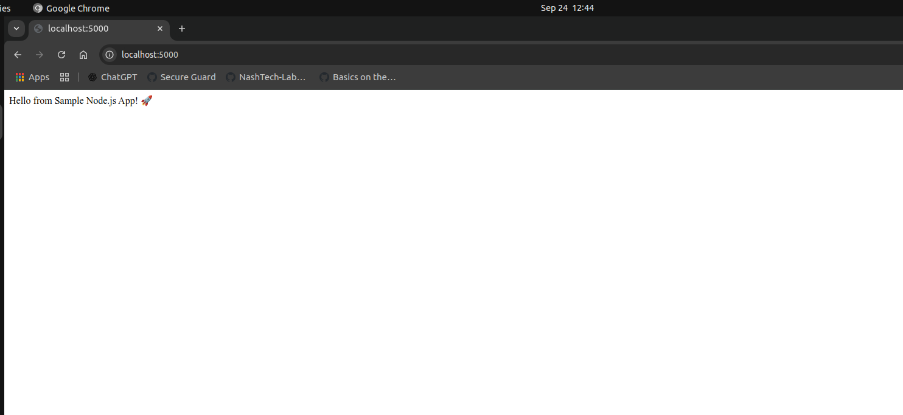

# DevSecOps Hands-On: Code Security & Shift-Left Practices

## Objective
Demonstrate understanding of **shift-left security principles** by scanning code for secrets, safely removing them, and deploying an application securely.

## Tasks
1. **Use a sample code repository**  
   I have prepared an app.js file which contains secrets to be detected by gitleaks

2. **Set up Gitleaks**  
   - Install Gitleaks locally 
     cd ~/VSProjects/pi-shaped-devsecops-deepanshgupta/day-1
     curl -LO https://github.com/gitleaks/gitleaks/releases/download/v8.28.0/gitleaks_8.28.0_linux_x64.tar.gz
     tar -xzvf gitleaks_8.28.0_linux_x64.tar.gz
     mv gitleaks_8.28.0_linux_x64 gitleaks

   - Configure Gitleaks with a `.gitleaks.toml` configuration file to detect secrets such as API keys, passwords, and other sensitive data.
     chmod +x gitleaks- Configured custom rules in `.gitleaks.toml` for precision.

3. **Scan the repository for secrets**  
   ```bash
   gitleaks detect --source=. --config=.gitleaks.toml

***Before removing the secrets***


***After scanning and removing the secrets***


## App Deploy
Build Docker image using 
    ```bash
    docker build -t dev-sec-ops-app .
Run: docker run -p 5000:5000 -name dev-sec-ops-app-container dev-sec-ops-app



## Challenges
Challenge: Gitleaks unable to detect the secrets
Solution: Added a .gitleaks.toml file

## Core Concept Questions
***Explain Shift-Left Security and Why It’s Important in DevSecOps***
Shift-Left integrates security measures early in the software development lifecycle (SDLC) as opposed to addressing them at the end.
Security testing is typically carried out during testing or deployment, close to the conclusion of development. By integrating security into the planning, design, and coding phases, shift-left reverses this. It is important because it is cost efficient, helps with compliance and governance, improves security posture and helps with faster delivery as well. 


***How Does Detecting Secrets Early in the CI/CD Pipeline Prevent Production Vulnerabilities***
Detecting secrets before code reaches production ensures vulnerabilities are stopped before they can be exploited:

1. Prevents Leaks in Version Control:
    Tools like GitLeaks or TruffleHog scan code during build or commit to ensure no secrets are committed.
2. Automates Security Checks:
    CI/CD pipelines can automatically fail builds if secrets are found, preventing risky code from being deployed.
3. Reduces Incident Response Costs:
    Fixing a leaked secret in development is much cheaper and faster than rotating credentials after a breach in production.
4. Maintains Compliance:
    Early detection ensures sensitive data handling meets regulatory standards (like GDPR, HIPAA, or PCI DSS).
5. Protects Downstream Dependencies:
    Secrets in code can be propagated to logs, containers, or cloud environments. Detecting them early stops this chain reaction.

***What Strategies Can Be Used to Store Secrets Securely Instead of Hardcoding Them***
1. Environment Variables
    Store secrets as environment variables on the server or container.
    Access them in code using standard environment variable APIs.
2. Secret Management Services
    Use dedicated tools for secret storage and retrieval. Examples:
    AWS Secrets Manager
    HashiCorp Vault
    Azure Key Vault
    Google Secret Manager
3. Use a CI/CD Secrets Vault
    Many CI/CD systems provide secret storage:
    GitHub Actions Secrets
    GitLab CI/CD Variables
    Jenkins Credentials Plugin

***Describe a Situation Where a Secret Could Still Be Exposed Even After Scanning, and How to Prevent It***

Even if a CI/CD pipeline or code repository scanning tool detects secrets in the code, secrets can still leak at runtime if the application or infrastructure is misconfigured.

Scenario:

A developer uses environment variables or a secret manager (like AWS Secrets Manager) to avoid hardcoding secrets.

The code itself passes security scans successfully.

However, the application logs environment variables for debugging or error reporting.

These logs are stored in a centralized logging system (e.g., ELK stack, CloudWatch) accessible to multiple users.

Attackers or unauthorized personnel who access the logs can now see the secrets, even though the code itself is “clean.”