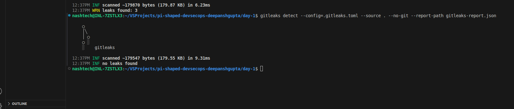

# DevSecOps Hands-On: Code Security & Shift-Left Practices

## Objective
Demonstrate understanding of **shift-left security principles** by scanning code for secrets, safely removing them, and deploying an application securely.

## Tasks
1. **Use a sample code repository**  
   I have prepared an app.js file which contains secrets to be detected by gitleaks

2. **Set up Gitleaks**  
   - Install Gitleaks locally 
     cd ~/VSProjects/pi-shaped-devsecops-deepanshgupta/day-1
     curl -LO https://github.com/gitleaks/gitleaks/releases/download/v8.28.0/gitleaks_8.28.0_linux_x64.tar.gz
     tar -xzvf gitleaks_8.28.0_linux_x64.tar.gz
     mv gitleaks_8.28.0_linux_x64 gitleaks

   - Configure Gitleaks with a `.gitleaks.toml` configuration file to detect secrets such as API keys, passwords, and other sensitive data.
     chmod +x gitleaks- Configured custom rules in `.gitleaks.toml` for precision.

3. **Scan the repository for secrets**  
   ```bash
   gitleaks detect --source=. --config=.gitleaks.toml

***Before removing the secrets***


***After scanning and removing the secrets***
