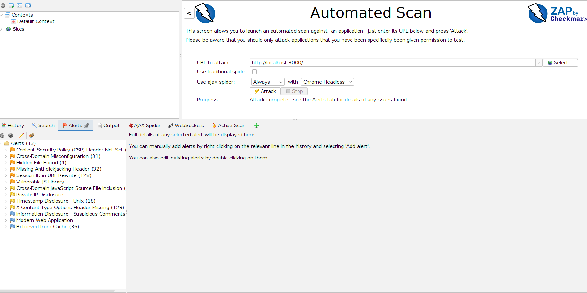
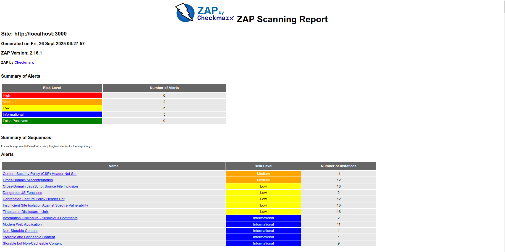

# DevSecOps Hands-On: Code Security & Shift-Left Practices

## Objective
This project demonstrates the integration of OWASP ZAP (Zed Attack Proxy) into a CI/CD pipeline to perform automated security scans on OWASP Juice Shop application. The goal is to identify vulnerabilities, align them with the OWASP Top 10, and propose actionable fixes to secure the application.

Application: OWASP Juice Shop
Security Tool: OWASP ZAP
CI/CD Platform: GitHub Actions

# Testing OWASP Juice Shop with OWASP ZAP

This guide explains how to run OWASP ZAP scans against OWASP Juice Shop and generate a vulnerability report.

---

## 1. Prerequisites
- [Docker](https://docs.docker.com/get-docker/) installed and running  
- Basic knowledge of running Docker containers  

---

## 2. Start OWASP Juice Shop
Run Juice Shop locally on port `3000`:

```bash
docker run -d --name juice-shop -p 3000:3000 bkimminich/juice-shop
```

Verify it’s running:

```bash
curl http://localhost:3000
```

---

## 3. Run OWASP ZAP Baseline Scan
Create a folder for reports and run the ZAP baseline scan:

```bash
mkdir -p zap-reports
chmod 777 zap-reports

docker run --network host   -v $(pwd)/zap-reports:/zap/wrk   ghcr.io/zaproxy/zaproxy:stable zap-baseline.py   -t http://localhost:3000   -r zap-report.html
```

This will:
- Perform a passive scan against `http://localhost:3000`  
- Generate **`zap-report.html`** inside the `zap-reports/` directory  

---

## 4. View the Report
Open the generated report in your browser:

```bash
open zap-reports/zap-report.html     # macOS
xdg-open zap-reports/zap-report.html # Linux
```
---

## 5. Cleanup
After testing, stop and remove the Juice Shop container:

```bash
docker stop juice-shop && docker rm juice-shop
```

## Screenshots




# Vulnerability Identification & Analysis

## Vulnerability 1: CWE-639: Authorization Bypass Through User-Controlled Key

### Description 

The application allows users to submit and modify customer feedback via an API endpoint (/api/Feedbacks/). However, there is no authentication or authorization check, allowing any user to manipulate feedback, even if they are not the original submitter. This vulnerability is known as Insecure Direct Object Reference (IDOR) or Improper Authorization. 

### Impact 

Data Integrity Violation – Malicious users can modify or delete feedback submitted by others. 

Reputation Damage – Attackers can submit fake reviews or modify feedback to harm or promote a business unfairly. 

Potential Compliance Issues – If feedback contains personal data, unauthorized modifications could lead to GDPR or other regulatory violations.

### Suggested Fix 

1. Implement Authentication & Authorization Checks 

Ensure only the original user who submitted the feedback can modify it. 

Implement role-based access control (RBAC) if feedback should only be modified by admins. 

2. Validate Input on the Server 

Verify that the captchaId and captcha values are correct. 

Ensure that the feedback comment field does not contain inappropriate content. 

3. Use Secure HTTP Methods 

Limit modification permissions to PUT or PATCH requests instead of POST. 

Ensure that users can only modify their own feedback entries. 

4. Implement Logging and Monitoring 

Track feedback modifications to detect unauthorized changes. 

Alert admins if many modifications happen in a short time. 


## Vulnerability 2: CWE 200: Information Disclosure 

### Description 

The server is exposing CAPTCHA answers via an API response. This is a critical vulnerability because CAPTCHA mechanisms are intended to prevent automated bots, but if the answers are retrievable via a simple GET request, attackers can bypass CAPTCHA validation entirely. 

### Impact 

Automated Bot Attacks – Attackers can programmatically retrieve CAPTCHA answers and automate spam, brute-force, and account takeover attacks. 

Reduced Security of Authentication & Forms – If CAPTCHA is used to prevent abuse (e.g., login, registration, feedback submission), its security is entirely compromised. 

Bypass of Rate Limiting & Anti-Automation Mechanisms – Bots can continuously retrieve valid CAPTCHA answers and submit automated requests. 

### Suggested Fix 

1. Never Expose CAPTCHA Answers in API Responses 

The API should only return the CAPTCHA challenge, never the answer. 

2. Validate CAPTCHA on the Server-Side 

When the user submits an answer, validate it server-side without exposing it in the response. 

3. Implement Rate Limiting & Monitoring 

Detect multiple API requests attempting to retrieve CAPTCHA values and block suspicious behavior. 

Use tools like reCAPTCHA, hCaptcha, or bot detection services to strengthen protection. 

4. Encrypt or Hash CAPTCHA Answers 

Store CAPTCHA answers as hashed values in the backend, ensuring they cannot be retrieved in plaintext. 

# Core Concepts
---

## 1. What is the purpose of DAST and how does it complement other security testing methods?

DAST is a security testing methodology that analyzes a running application to find vulnerabilities from an attacker’s perspective. Unlike static testing, it does not require access to source code — it interacts with the application through its UI, APIs, or network interfaces.

Key purposes:

1. Detect runtime vulnerabilities

Identifies issues like SQL injection, XSS, CSRF, authentication flaws, and insecure configurations while the application is running.

2. Simulate real attacks

Tests how the application behaves under potential attacks, helping teams understand the impact of vulnerabilities.

3. Validate security controls

Confirms that input validation, access controls, encryption, and other security mechanisms are effective in real scenarios.

4. Continuous monitoring in DevSecOps

Integrates into CI/CD pipelines to catch vulnerabilities during development, not just in production.

## 2. Explain how XSS or SQL injection vulnerabilities can affect an application and its users.
XSS (Cross-Site Scripting): XSS happens when an attacker executes a malicious script (often JavaScript) within your app, typically by using some user input point (like a search box). If the XSS is not prevented, it can steal the user’s cookies (which is how the app can determine if the user is authenticated), redirect the user to fake sites to capture data, or change and alter how things are displayed to the user. For the user, this can mean their personal data (i.e., password) is stolen without their permission.

SQL Injection: A SQL Injection occurs when an attacker provides unsavory SQL (e.g. in a login form) to trick the app into pulling and/or modifying data in the database. At its worst, SQL injection exposses all user information, alters the data, and allows the attacker take control over the app. In this case, the user may lose their account, data could be altered or completely deleted, the user’s data could even be sold on the dark web.

## 3. Describe the steps you would take to fix the vulnerabilities detected in your ZAP scan.
. Implement Authentication & Authorization Checks 

Ensure only the original user who submitted the feedback can modify it. 

Implement role-based access control (RBAC) if feedback should only be modified by admins. 

2. Validate Input on the Server 

Verify that the captchaId and captcha values are correct. 

Ensure that the feedback comment field does not contain inappropriate content. 

3. Use Secure HTTP Methods 

Limit modification permissions to PUT or PATCH requests instead of POST. 

Ensure that users can only modify their own feedback entries. 

4. Implement Logging and Monitoring 

Track feedback modifications to detect unauthorized changes. 

Alert admins if many modifications happen in a short time.

## 4. How does integrating ZAP scans into CI/CD pipelines support shift-left security practices?
What is Shift-Left?: Shift-left means moving security checks to the beginning of the development process, not just at the end. It’s like fixing a leaky pipe as soon as you see a drip, not after the house floods!

How ZAP Helps: By adding ZAP scans to the CI/CD pipeline (e.g., on every push to main), we catch security issues early—while coding or testing—rather than after deployment. This saves time and money, as fixing bugs later is harder and costlier.

Benefits: Developers get instant feedback (e.g., 8 warnings in our scan), can fix problems before release, and build a habit of secure coding. It’s like having a safety net that catches issues before they reach users!